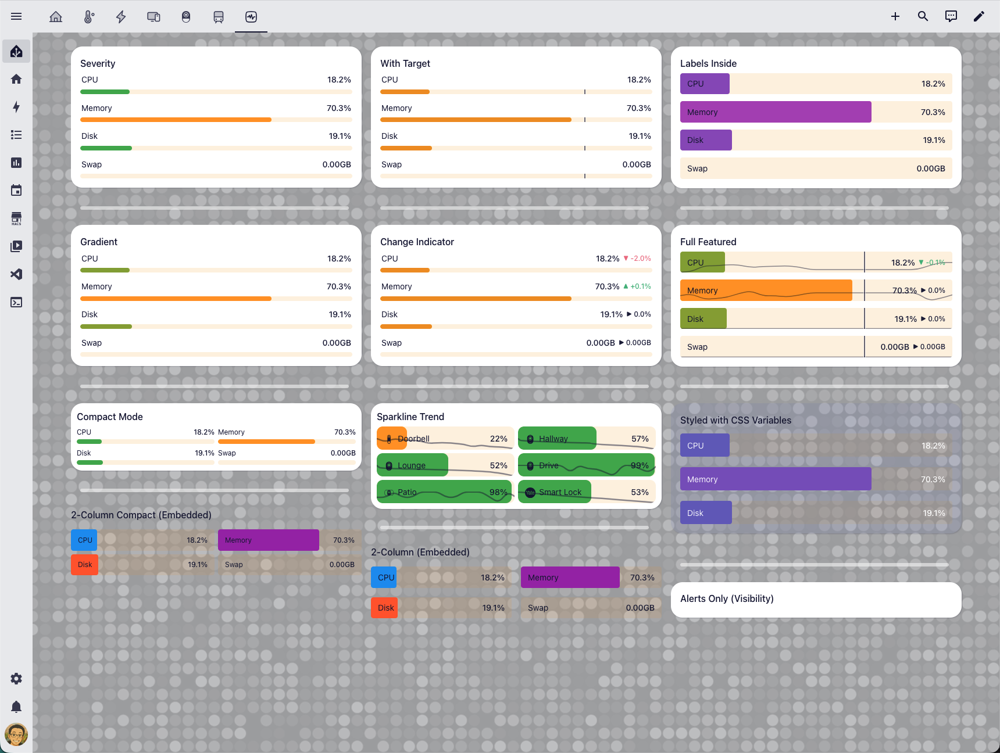
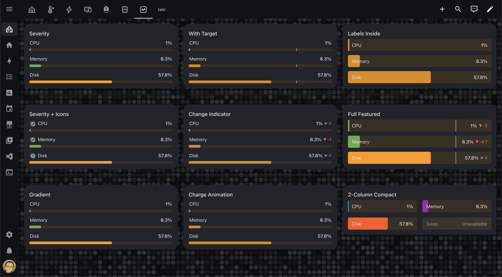
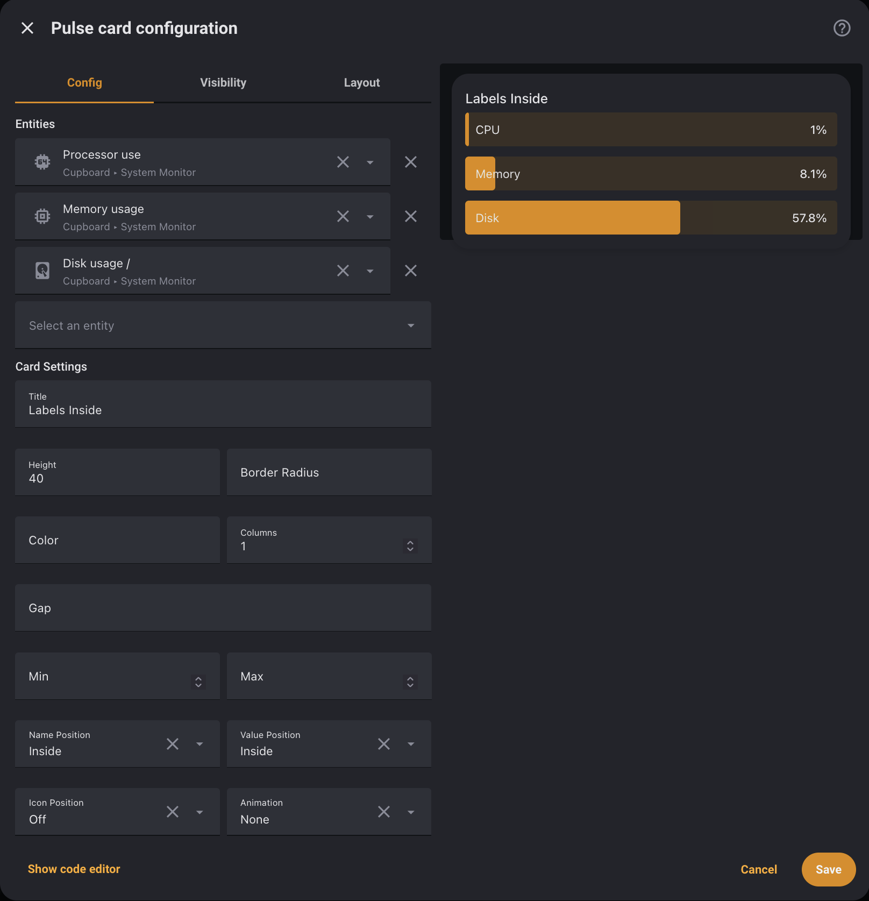

# Pulse Card

<div align="center">


<!-- Platform Badges -->


<!-- Status Badges -->


<!-- Community Badges -->


<!-- Support -->
[](https://buymeacoffee.com/hiallfyi)

**Compact horizontal bar chart card for Home Assistant sensor data visualization.**

**A modern replacement for bar-card — minimal, fast, zero dependencies.**

[Quick Start](#quick-start) • [Configuration](#configuration-reference) • [Migration](#bar-card-migration) • [Contributing](CONTRIBUTING.md) • [Discussions](https://github.com/hiall-fyi/pulse-card/discussions)

</div>

---

## Why Pulse Card?

The original `bar-card` was delisted from HACS in 2025 after years without maintenance. Community alternatives are either too complex or too limited. Pulse Card fills that gap — a clean, opinionated bar chart card that works out of the box.

- **Install and go** — sensible defaults, no YAML wizardry needed
- **Visual editor** — configure via GUI in 5 seconds
- **bar-card compatible** — just change `type` to migrate
- **Zero dependencies** — pure vanilla JS, single file, <50KB
- **Sections view ready** — proper grid sizing support





---

## Features

- Horizontal bar display for any numeric sensor
- Multiple entities in a single card with per-entity overrides
- Severity-based color ranges with gradient mode
- Visual editor via `ha-form` schema
- Target marker overlay (static value or entity ID)
- Change indicator (▲/▼) with history comparison
- Tap, hold, and double-tap actions
- Charge animation effect
- Entity row mode (for use inside entities card)
- Sections view grid support
- Full dark/light theme integration
- ARIA progressbar attributes for accessibility

---

## Quick Start

### Installation via HACS (Recommended)

[](https://my.home-assistant.io/redirect/hacs_repository/?owner=hiall-fyi&repository=pulse-card&category=plugin)

1. Click the button above (or search for **Pulse Card** in HACS → **Frontend**)
2. Click **Download**
3. Restart Home Assistant

<details>
<summary>Manual Installation</summary>

1. Download `pulse-card.js` from the [latest release](https://github.com/hiall-fyi/pulse-card/releases)
2. Copy to `config/www/pulse-card.js`
3. Add resource in **Settings → Dashboards → Resources**:
   - URL: `/local/pulse-card.js`
   - Type: JavaScript Module

</details>

### Minimal Config

```yaml
type: custom:pulse-card
entity: sensor.battery_level
```

### Multiple Entities

```yaml
type: custom:pulse-card
title: Room Sensors
entities:
  - sensor.temperature
  - entity: sensor.humidity
    name: Humidity
    color: "#2196F3"
  - entity: sensor.battery
    severity:
      - from: 0
        to: 20
        color: "#F44336"
      - from: 21
        to: 50
        color: "#FF9800"
      - from: 51
        to: 100
        color: "#4CAF50"
```

### Classic Mode (bar-card style)

```yaml
type: custom:pulse-card
entity: sensor.battery
height: "40px"
positions:
  icon: outside
  name: inside
  value: inside
```

---

## Configuration Reference

| Option | Type | Default | Description |
|---|---|---|---|
| `entity` | string | **required** | Entity ID (single entity mode) |
| `entities` | list | — | Array of entity IDs or entity config objects |
| `name` | string | friendly_name | Display name |
| `icon` | string | entity icon | MDI icon (e.g. `mdi:battery`) |
| `min` | number | `0` | Minimum value |
| `max` | number | `100` | Maximum value |
| `color` | string | HA primary | Bar fill color |
| `height` | string | `8px` | Bar height |
| `border_radius` | string | `4px` | Bar border radius |
| `decimal` | number | auto | Decimal places |
| `unit_of_measurement` | string | entity unit | Unit suffix |
| `attribute` | string | — | Use entity attribute instead of state |
| `target` | number/string | — | Target marker (value or entity ID) |
| `entity_row` | boolean | `false` | Render without card wrapper |
| `complementary` | boolean | `false` | Show remaining value |
| `limit_value` | boolean | `false` | Clamp value to min/max |
| `columns` | number | `1` | Bars per row (grid layout) |
| `title` | string | — | Card title header |

### Positions

```yaml
positions:
  icon: off        # inside | outside | off
  name: outside    # inside | outside | off
  value: outside   # inside | outside | off
  minmax: off      # inside | outside | off
  indicator: off   # inside | outside | off
```

### Animation

```yaml
animation:
  state: "on"      # on | off
  speed: 0.8       # seconds
  effect: "none"   # none | charge
```

### Severity

```yaml
severity:
  - from: 0
    to: 20
    color: "#F44336"
    icon: "mdi:battery-alert"    # optional icon override
  - from: 21
    to: 50
    color: "#FF9800"
  - from: 51
    to: 100
    color: "#4CAF50"
```

Add `mode: gradient` to any severity entry for smooth color interpolation between stops.

### Indicator

```yaml
indicator:
  show: true
  period: 60          # minutes to compare
  show_delta: false   # show +/- delta value
```

### Tap Actions

```yaml
tap_action:
  action: more-info    # more-info | navigate | call-service | url | none
hold_action:
  action: none
double_tap_action:
  action: none
```

Per-entity actions are supported in multi-entity mode.

### Target (Object Config)

```yaml
target:
  value: 80              # static number or entity ID
  show_label: true       # show value label above marker
```

---

## Style Presets

Pulse Card ships with a minimal default (8px thin bar, labels outside). Here are ready-to-use presets for common styles.

### Default — Minimal Thin Bar

```yaml
type: custom:pulse-card
entity: sensor.battery_level
```

```
  Battery                              75%
  ┌████████████████████████████░░░░░░░░░░┐   ← 8px bar
```

### Classic — bar-card Style

Matches the original bar-card look with a chunky bar and labels inside.

```yaml
type: custom:pulse-card
entity: sensor.battery_level
height: "40px"
positions:
  icon: outside
  name: inside
  value: inside
```

```
  🔋 ┌─────────────────────────────────────┐
     │ Battery                        75%  │   ← 40px bar, text inside
     └─────────────────────────────────────┘
```

### Compact — Dashboard Overview

Ideal for packing many sensors into a small card.

```yaml
type: custom:pulse-card
title: System
columns: 2
entities:
  - sensor.cpu_usage
  - sensor.memory_usage
  - sensor.disk_usage
  - sensor.swap_usage
```

### Severity Colors

Color-coded ranges that change automatically based on value.

```yaml
type: custom:pulse-card
entity: sensor.battery_level
severity:
  - from: 0
    to: 20
    color: "#F44336"
    icon: "mdi:battery-alert"
  - from: 21
    to: 50
    color: "#FF9800"
    icon: "mdi:battery-50"
  - from: 51
    to: 100
    color: "#4CAF50"
    icon: "mdi:battery"
positions:
  icon: outside
```

### Gradient Mode

Smooth color interpolation between severity stops.

```yaml
type: custom:pulse-card
entity: sensor.temperature
min: 15
max: 35
severity:
  - from: 15
    to: 20
    color: "#2196F3"
    mode: gradient
  - from: 20
    to: 25
    color: "#4CAF50"
    mode: gradient
  - from: 25
    to: 35
    color: "#F44336"
    mode: gradient
```

### With Target Marker

Shows a reference line on the bar (e.g. target temperature).

```yaml
type: custom:pulse-card
entity: sensor.temperature
min: 15
max: 35
target:
  value: 22
  show_label: true
```

### Entity Row Mode

Use inside an `entities` card — renders without the card wrapper.

```yaml
type: entities
entities:
  - entity: light.living_room
  - type: custom:pulse-card
    entity: sensor.living_room_temperature
    entity_row: true
  - entity: switch.fan
```

### With Change Indicator

Shows trend arrow (▲/▼) comparing current value to a previous period.

```yaml
type: custom:pulse-card
entity: sensor.temperature
indicator:
  show: true
  period: 60
  show_delta: true
positions:
  indicator: outside
```

---

## bar-card Migration

Pulse Card accepts bar-card's core config keys. To migrate, change `type` to `custom:pulse-card`:

```yaml
# Before (bar-card)
type: custom:bar-card
entity: sensor.battery
severity:
  - from: 0
    to: 20
    color: red

# After (Pulse Card)
type: custom:pulse-card
entity: sensor.battery
severity:
  - from: 0
    to: 20
    color: red
```

**Key differences from bar-card:**
- Default bar height is `8px` (bar-card was `40px`)
- Default positions: name/value `outside`, icon `off`
- `rounding` is renamed to `border_radius`
- `width`, `saturation`, `hue`, `entity_config` are not supported

---

## Known Limitations

- Per-entity overrides in the visual editor are not yet supported — use YAML for per-entity `severity`, `target`, `indicator`, or `positions` config
- `width`, `saturation`, `hue`, and `entity_config` from bar-card are not supported
- History-based indicator requires the HA `recorder` component to be enabled

---

## Development

```bash
npm install
npm run build    # Build dist/pulse-card.js
npm run dev      # Watch mode
npm test         # Run tests
npm run lint     # Lint source
```

See [CONTRIBUTING.md](CONTRIBUTING.md) for full development guidelines.

---

## License

**GNU Affero General Public License v3.0 (AGPL-3.0)**

Free to use, modify, and distribute. Modifications must be open source under AGPL-3.0 with attribution.

**Author:** Joe Yiu ([@hiall-fyi](https://github.com/hiall-fyi))

See [LICENSE](LICENSE) for full details.

---

<div align="center">

**Built with ❤️ for the Home Assistant community.**

[Report Bug](https://github.com/hiall-fyi/pulse-card/issues) • [Request Feature](https://github.com/hiall-fyi/pulse-card/discussions)

[](https://star-history.com/#hiall-fyi/pulse-card&Date)

</div>

---

<details>
<summary><strong>Disclaimer</strong></summary>

This project is not affiliated with, endorsed by, or connected to Home Assistant or Nabu Casa, Inc. Home Assistant is a trademark of Nabu Casa, Inc.
This card is provided "as is" without warranty. Use at your own risk.

</details>
