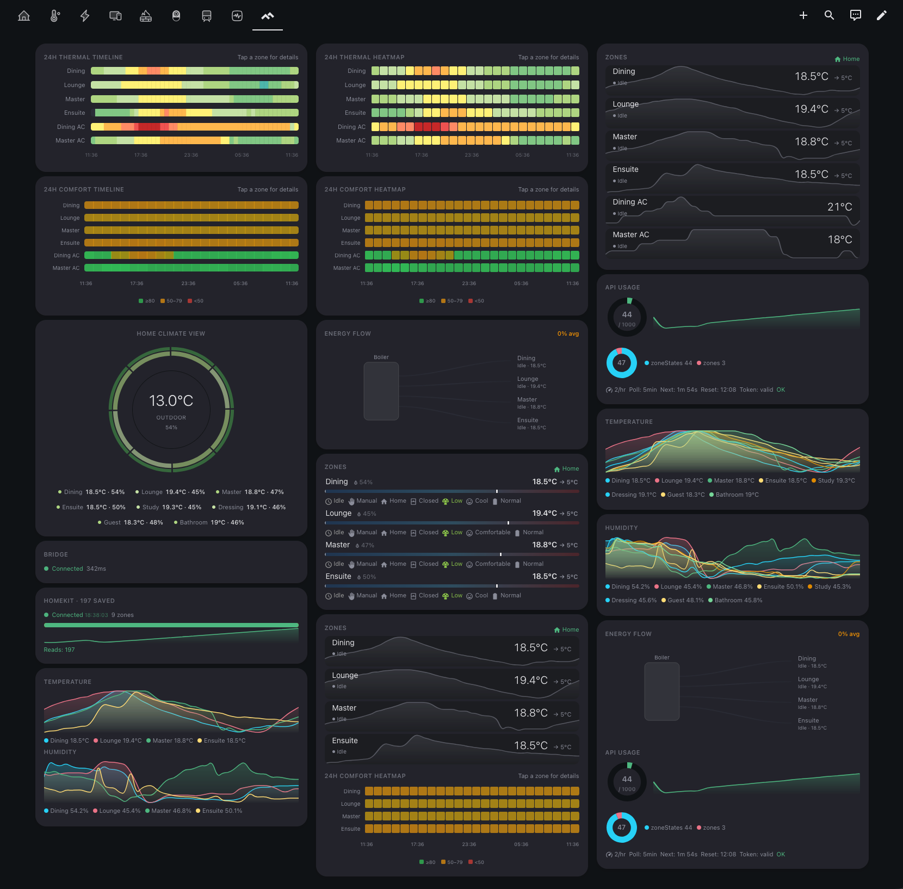

<div align="center">

<picture>
  <source media="(prefers-color-scheme: dark)" srcset="brand/dark_logo@2x.png" />
  
</picture>

<br />

<em>Data at a glance. Climate at your fingertips.</em>

<!-- Platform Badges -->


<!-- Status Badges -->


<!-- Community Badges -->


<!-- Support -->
[](https://buymeacoffee.com/hiallfyi)

**Two cards, one install — compact bar charts and a full climate dashboard.**

[Pulse Card Guide](PULSE_CARD_GUIDE.md) • [Climate Card Guide](CLIMATE_CARD_GUIDE.md) • [Contributing](CONTRIBUTING.md) • [Discussions](https://github.com/hiall-fyi/pulse-card/discussions)

</div>

---

## What's Inside

### Pulse Card

A compact horizontal bar chart card — a modern replacement for the discontinued bar-card. Show any numeric sensor as a clean bar with severity colors, sparkline trends, target markers, and slider mode.


**Highlights:** severity colors · sparkline trends · slider mode · multi-column grid · conditional visibility · bar-card compatible

📖 **[Full Configuration Guide →](PULSE_CARD_GUIDE.md)**

### Pulse Climate Card

A climate dashboard card that gives you a visual overview of your heating and cooling system. Works with any `climate.*` entity, and auto-discovers Tado CE sensors for an enriched display.



**Highlights:** multi-zone overview · temperature & power bars · sparkline modes · radial thermal view · energy flow particles · frosted glass panels · heat shimmer · thermal & comfort strips · interactive temperature slider

📖 **[Full Configuration Guide →](CLIMATE_CARD_GUIDE.md)**

---

## Installation

### HACS (Recommended)

[](https://my.home-assistant.io/redirect/hacs_repository/?owner=hiall-fyi&repository=pulse-card&category=plugin)

1. Click the button above (or search for **Pulse Card** in HACS → **Frontend**)
2. Click **Download**
3. Restart Home Assistant

Both cards are included in a single install — no separate downloads needed.

<details>
<summary>Manual Installation</summary>

1. Download `pulse-card.js`, `pulse-card-editor.js`, and `pulse-climate-editor.js` from the [latest release](https://github.com/hiall-fyi/pulse-card/releases)
2. Copy all three to `config/www/`
3. Add resource in **Settings → Dashboards → Resources**:
   - URL: `/local/pulse-card.js`
   - Type: JavaScript Module

</details>

---

## Quick Start

### Pulse Card

```yaml
type: custom:pulse-card
entity: sensor.battery_level
```

```yaml
type: custom:pulse-card
title: Room Sensors
entities:
  - sensor.temperature
  - entity: sensor.humidity
    name: Humidity
    color: "#2196F3"
```

### Pulse Climate Card

```yaml
type: custom:pulse-climate-card
entity: climate.living_room
```

```yaml
type: custom:pulse-climate-card
zones:
  - entity: climate.living_room
  - entity: climate.bedroom
  - entity: climate.kitchen
sections:
  - zones
  - graph
  - radial
```

---

## Guides

| Card | Guide | What's covered |
|---|---|---|
| **Pulse Card** | [PULSE_CARD_GUIDE.md](PULSE_CARD_GUIDE.md) | Configuration reference, style presets, bar-card migration, CSS custom properties, known limitations |
| **Pulse Climate Card** | [CLIMATE_CARD_GUIDE.md](CLIMATE_CARD_GUIDE.md) | Zone setup, section types, sparkline modes, Tado CE auto-discovery, visual identity, actions & interactivity |

---

## Development

```bash
npm install
npm run build      # Build dist/pulse-card.js
npm run dev        # Watch mode
npm test           # Run tests
npm run lint       # Lint source
npm run typecheck  # JSDoc type checking via tsc
```

See [CONTRIBUTING.md](CONTRIBUTING.md) for full development guidelines.

---

## License

**GNU Affero General Public License v3.0 (AGPL-3.0)**

Free to use, modify, and distribute. Modifications must be open source under AGPL-3.0 with attribution.

**Author:** Joe Yiu ([@hiall-fyi](https://github.com/hiall-fyi))

See [LICENSE](LICENSE) for full details.

---

<div align="center">

**Built with ❤️ for the Home Assistant community.**

[Report Bug](https://github.com/hiall-fyi/pulse-card/issues) • [Request Feature](https://github.com/hiall-fyi/pulse-card/discussions)

[](https://star-history.com/#hiall-fyi/pulse-card&Date)

</div>

---

<details>
<summary><strong>Disclaimer</strong></summary>

This project is not affiliated with, endorsed by, or connected to Home Assistant or Nabu Casa. All trademarks belong to their respective owners.

</details>
